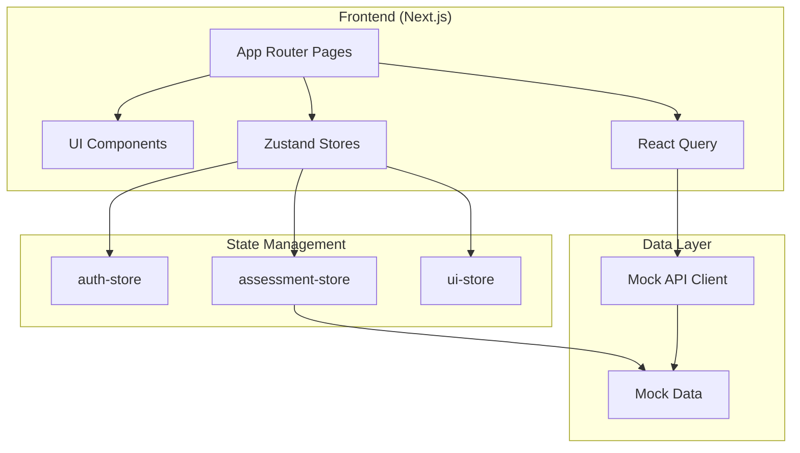

# Архитектура РосКомпетенции

## Обзор системы

Платформа состоит из двух доменов:

1. **Candidate Domain** — прохождение тестов, профиль, медали, рейтинг
2. **Recruiter Domain** — поиск, фильтрация, аналитика кандидатов



## Zustand Store Architecture

### auth-store
- `user`, `token`, `isAuthenticated`
- `login()`, `logout()`, `switchRole()`
- Persist: localStorage (`roseltorg-auth`)

### assessment-store
- `session`, `result`
- `startSession(userId, mode, topicId?)`
- `submitAnswer(answer)` — адаптивная сложность
- `completeSession()` — расчёт результата, AI-summary
- `resetSession()`

### ui-store
- `sidebarOpen`, `mobileMenuOpen`
- `recruiterFilters` — фильтры каталога кандидатов

## Адаптивный алгоритм

```
initialDifficulty = 2
for each answer (15-20 questions):
  if correct: difficulty = min(difficulty + 1, 4)
  else:       difficulty = max(difficulty - 1, 1)
  select next task with matching difficulty

grade = f(accuracy):
  >= 85% → Эксперт
  >= 60% → Базовый специалист
  <  60% → Стажёр
```

## Типы заданий (Task Engine)

| Type | Component | Validation |
|------|-----------|------------|
| text-highlight | TextHighlightTask | sentence index |
| article-search | ArticleSearchTask | option id |
| step-sorting | StepSortingTask | order array |
| missing-step | MissingStepTask | option id |
| fill-blanks | FillBlanksTask | blank answers |
| nmck-calculation | NmckCalculationTask | numeric ± tolerance |
| fas-case | FasCaseTask | option id |
| find-violation | FindViolationTask | violation id |
| next-step | NextStepTask | option id |

## Design System

| Token | Value | Usage |
|-------|-------|-------|
| Primary | #005BBB | HH.ru-style trust blue |
| Success | #58CC02 | Duolingo green |
| Accent | #1CB0F6 | Interactive highlights |
| Radius | 1rem | Cards, buttons |
| Font | Geist Sans | UI typography |

## User Scenarios

### Кандидат: определение уровня
1. Login → Dashboard
2. «Определить уровень» → `/assessment/global`
3. 15-20 адаптивных заданий
4. Results: грейд, карта компетенций, AI-заключение
5. Profile: медали, достижения

### Кандидат: тематический тест
1. Topics → выбор темы (44-ФЗ)
2. Выбор режима: competency / basic / medium / hard
3. Прохождение → медаль (bronze → platinum)

### Рекрутер: подбор
1. Login (recruiter) → `/recruiter`
2. Candidates → фильтры (грейд, тема, медаль, score)
3. Candidate card → analytics, AI-summary, comparison

## Deployment (production)

```
Next.js → Vercel / Docker
API → NestJS / FastAPI (future)
DB → PostgreSQL
Auth → Keycloak / OAuth2
AI → LLM API для генерации заключений
```
