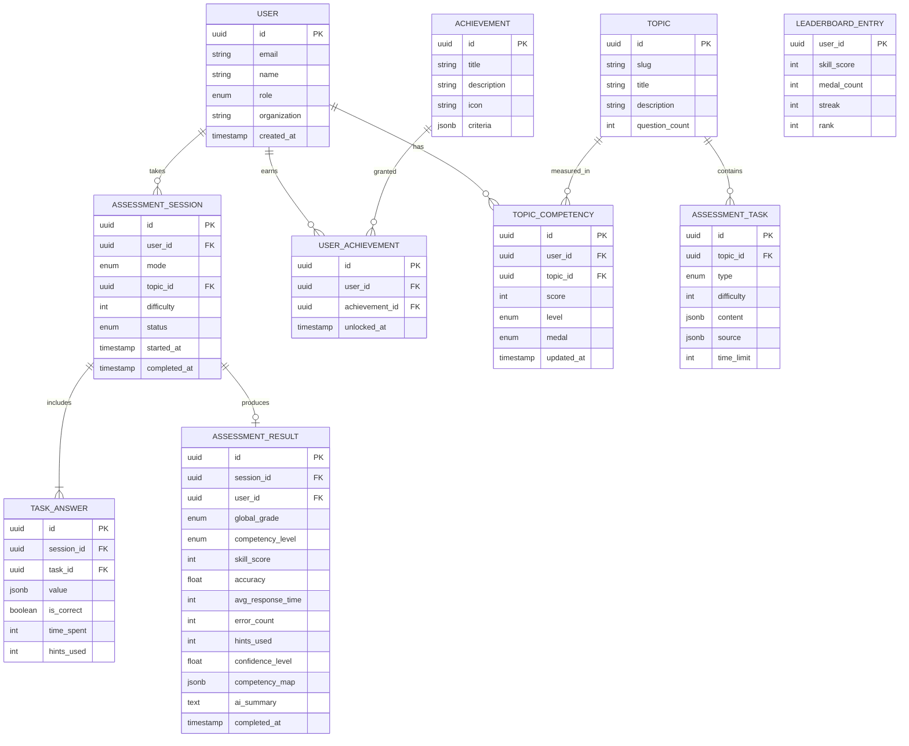

# ER-диаграмма — РосКомпетенции

## Индексы (production)

- `user(email)` UNIQUE
- `assessment_session(user_id, status)`
- `topic_competency(user_id, topic_id)` UNIQUE
- `assessment_result(user_id, completed_at DESC)`
- `leaderboard_entry(skill_score DESC)`

## Медали — бизнес-правила

| Score | Medal |
|-------|-------|
| ≥ 95% | Platinum |
| ≥ 85% | Gold |
| ≥ 70% | Silver |
| ≥ 50% | Bronze |

## Грейды — общий тест

| Accuracy | Global Grade |
|----------|--------------|
| ≥ 85% | expert |
| ≥ 60% | basic |
| < 60% | intern |
